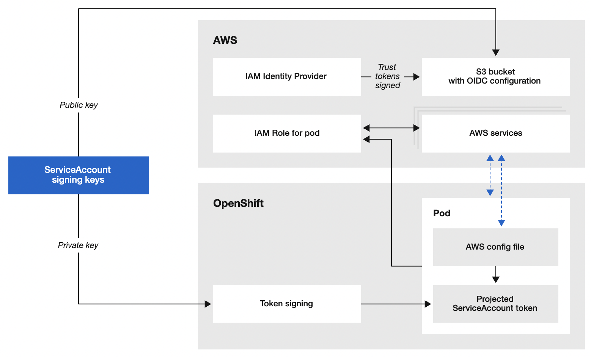

# Running pods in Openshift with AWS IAM Roles for service accounts a.k.a. IRSA


## By: Alejandro Guadarrama Dominguez

You can associate an IAM role with an Openshift service account. This Openshift service account can then be used to run a pod providing AWS permissions to the containers. With this feature pods on Openshift can call AWS APIs.

Pod applications must sign their AWS API requests with AWS Security Token Service (AWS STS) as a web service that enables you to request temporary, limited-privilege credentials for AWS Identity and Access Management (IAM). This feature provides a strategy for managing credentials for your applications. The applications in the pod’s containers can then use an AWS SDK or the AWS CLI to make API requests to authorized AWS services.

The IAM roles for service accounts feature provides the following benefits:


* **Least privilege** — By using the IAM roles for service accounts feature, you no longer need to provide extended permissions to the node IAM role so that pods on that node can call AWS APIs. You can scope IAM permissions to a service account, and only pods that use that service account have access to those permissions.
* **Credential isolation** — A container can only retrieve credentials for the IAM role that is associated with the Openshift service account and namespace to which it belongs. A container never has access to credentials that are intended for another container that belongs to another pod or namespace.
* **Auditability** — Access and event logging is available through AWS CloudTrail to help ensure retrospective auditing.

To enable the use of IAM Roles for Openshift service accounts you should configure an AWS cluster in manual mode to use Amazon Web Services Secure Token Service (AWS STS). With this configuration, the CCO uses temporary credentials for different components.





To deploy a cluster with CCO in manual mode with STS you can check the documentation [https://docs.openshift.com/container-platform/4.8/authentication/managing_cloud_provider_credentials/cco-mode-sts.html](https://docs.openshift.com/container-platform/4.8/authentication/managing_cloud_provider_credentials/cco-mode-sts.html). This blog doesn’t show how to do that. We will focus on how to use the feature to run pods with temporary, limited-privilege credentials provided by AWS STS.


# Prepare IAM roles and link with Openshift service accounts


# Option 1: using ccoctl tool

This is an example of a **CredentialsRequest** resource to create any role to use for an Openshift service account.


```yaml
apiVersion: cloudcredential.openshift.io/v1
kind: CredentialsRequest
metadata:
  labels:
    controller-tools.k8s.io: "1.0"
  name: manual-sts
  namespace: manual-sts
spec:
  providerSpec:
    apiVersion: cloudcredential.openshift.io/v1
    kind: AWSProviderSpec
    statementEntries:
    - action:
      - s3:Get*
      - s3:Put*
      effect: Allow
      resource: '*'
  secretRef:
    name: manual-sts
    namespace: manual-sts
  serviceAccountNames:
  - sa-manual-sts
```


It's very important to create the role with the **ccoctl** tool, this step is to create the IAM role and link internally to the Openshift service account and namespace. Once it is created the IAM role can be modified by adding or removing permissions in AWS IAM Console. Also running aws iam commands, or using an automation tool like ansible or terraform.

The **ccoctl** tool can create one or more CredentialsRequest, the tool receives a folder as parameter and processes all the CredentialsRequest yaml files in the folder, in this case we save the file in the **credrequests** folder.


```
[root@bastion ~]# ccoctl aws create-iam-roles \
  --name=prefix-role \
  --region=us-east-1 \
  --credentials-requests-dir=credrequests  \
--identity-provider-arn=arn:aws:iam::1234567890:oidc-provider/manual-sts-oidc.s3.us-east-1.amazonaws.com  \
  --output-dir=outputs
```


The command above will create a file or files with an Openshift secret to being applied in the namespace. The identity provider is the value in the pre installation tasks, or you can get in the amazon console IAM -> Identity providers.

outputs/manual-sts-manual-sts-credentials.yaml.


```yaml
apiVersion: v1
stringData:
  credentials: |-
    [default]
    role_arn = arn:aws:iam::1234567890:role/prefix-role-manual-sts-manual-sts
    web_identity_token_file = /var/run/secrets/openshift/serviceaccount/token
kind: Secret
metadata:
  name: manual-sts
  namespace: manual-sts
type: Opaque
```


Also, we need to create the service(s) account(s) in the namespace


```
[root@bastion ~]# oc create sa sa-manual-sts
```


# How to assume the role

The below is an example of a POD running the **aws-cli **to test **aws sts assume-role-with-web-identity**,

The pod is placing the credentials in the file** /root/.aws/config** and setting 2 environment variables  AWS_ROLE_SESSION_NAME and AWS_REGION.

This example is not mounting directly the volume with the config file, because the path **/root/.aws** must be **writable** to let the aws-cli create the folder **/root/.aws/cli/cache** and store the temporary credentials if you are running aws-cli commands directly.

The pod has 3 requirements:


1. Run with the service account in the CredentialsRequest
2. Mount a volume with the secret generated after create the CredentialsRequest
3. Mount the service account token with the audience **openshift**

```yaml
apiVersion: v1
kind: Pod
metadata:
  annotations:
  labels:
    app: manual-sts
  name: manual-sts
  namespace: manual-sts
spec:
  containers:
  - image: amazon/aws-cli
    command: ["/bin/sh"]
    args: ["-c", "mkdir /root/.aws; cat /var/run/secrets/cloud/credentials > /root/.aws/config; sleep 86400"]
    imagePullPolicy: IfNotPresent
    name: manual-sts
    env:
    - name: AWS_ROLE_SESSION_NAME
      value: manual-sts-session
    - name: AWS_REGION
      value: us-east-1
    ports:
    - containerPort: 80
      name: http
      protocol: TCP
    resources:
      requests:
        cpu: 100m
        memory: 512Mi
    volumeMounts:
    - mountPath: /var/run/secrets/cloud
      name: manual-sts
      readOnly: false
    - mountPath: /var/run/secrets/openshift/serviceaccount
      name: bound-sa-token
      readOnly: true
  dnsPolicy: ClusterFirst
  serviceAccount: sa-manual-sts #<--The pod must run with the sa
  serviceAccountName: sa-manual-sts
  volumes:
  - name: manual-sts
    secret:
      defaultMode: 420
      optional: false
      secretName: manual-sts #<--This volume mount the config
  - name: bound-sa-token #<--The second volumen mount the web identity token
    projected:
      defaultMode: 420
      sources:
      - serviceAccountToken:
          audience: openshift
          expirationSeconds: 3600
          path: token
```


With the** /root/.aws/config** in the pod file we can run any AWS command, the client will request the assume role in the background, and will create the temporary credentials in the directory **/root/.aws/cli/cache**


```
[root@bastion ~]# ls -l /root/.aws/
total 4
-rw-r--r--. 1 root root 157 Jan 1 20:44 config

[root@bastion ~]# aws s3 ls
2020-11-13 18:01:43 fake1-buket
2021-10-03 18:01:39 fake2-buket
2021-11-19 01:13:29 fake3-buket
2022-12-18 18:02:45 manual-sts-oidc
2021-12-13 18:02:45 fake4-buket
[root@bastion ~]#

[root@bastion ~]# ls -l /root/.aws/
total 4
drwxr-xr-x. 3 root root  19 Jan 1 23:12 cli
-rw-r--r--. 1 root root 157 Jan 1 20:44 config

[root@bastion ~]# ls -l /root/.aws/cli/cache/
total 4
-rw-------. 1 root root 1887 Jan 1 23:12 234z3583d987653r6h3453455d5967b345529zs.json


[root@bastion ~]# cat /root/.aws/cli/cache/234z3583d987653r6h3453455d5967b345529zs.json | jq .
```


```json
{
  "Credentials": {
    "AccessKeyId": "FAKEKEYID",
    "SecretAccessKey": "FAKESECRETBLABLABLA",
    "SessionToken": "FAKETOKEN",
    "Expiration": "2022-01-01T13:13:13+00:00"
  },
  "SubjectFromWebIdentityToken": "system:serviceaccount:manual-sts:sa-manual-sts",
  "AssumedRoleUser": {
    "AssumedRoleId": "IORETJOGFNDLFKGJIOWKD:manual-sts-session",
    "Arn": "arn:aws:sts::0987654321:assumed-role/prefix-role-manual-sts-manual-sts/manual-sts-session"
  },
  "Provider": "arn:aws:iam::0987654321:oidc-provider/manual-sts-oidc.s3.us-east-1.amazonaws.com",
  "Audience": "openshift",
  "ResponseMetadata": {
    "RequestId": "9fddf440-80b6-11ec-a8a3-0242ac120002",
    "HTTPStatusCode": 200,
    "HTTPHeaders": {
      "x-amzn-requestid": "9fddf440-80b6-11ec-a8a3-0242ac120002",
      "content-type": "text/xml",
      "content-length": "2076",
      "date": "Sat, 1 Jan 2022 07:13:13 GMT"
    },
    "RetryAttempts": 0
  }
}
```


What happened here?. The aws-cli in the background try 3 tasks


1. Try to find the ~/.aws./credentials file if is not possible
2. Try to get the role from the metadata from http://169.254.169.254/latest/meta-data/ if is not possible
3. At the end based on the file in ~/.aws/config (see below) try to assume the role provided with the to env variables we set in the pod; regions and session name

```
[root@bastion ~]# cat /root/.aws/config
[default]
role_arn = arn:aws:iam::0987654321:role/prefix-role-manual-sts-manual-sts
```


Or we can run the command **aws iam  assume-role-with-web-identity**, it is the similar behavior when you use any language SDK, like boto3 in python.


```
[root@bastion]# TOKEN=$(cat /var/run/secrets/openshift/serviceaccount/token)
[root@bastion]# ARN=arn:aws:iam::0987654321:role/prefix-role-manual-sts-manual-sts
[root@bastion]# aws sts assume-role-with-web-identity \
  --role-arn $ARN \
  --role-session-name $AWS_ROLE_SESSION_NAME  \
  --web-identity-token $TOKEN \
  --duration-seconds 900
```


```json
{
    "Credentials": {
        "AccessKeyId": "FAKEKEYID",
        "SecretAccessKey": "FAKESECRETBLABLABLA",
        "SessionToken": "FAKETOKEN",
        "Expiration": "2022-01-01T13:13:13+00:00"
    },
    "SubjectFromWebIdentityToken": "system:serviceaccount:manual-sts:sa-manual-sts",
    "AssumedRoleUser": {
        "AssumedRoleId": "SDLKJSDFKJSDFKLSJFDSK:manual-sts-session",
        "Arn": "arn:aws:sts::0987654321:assumed-role/prefix-role-manual-sts-manual-sts/manual-sts-session"
    },
    "Provider": "arn:aws:iam::0987654321:oidc-provider/manual-sts-oidc.s3.us-east-1.amazonaws.com",
    "Audience": "openshift"
}
```


As you can see from the example above, it is very easy and transparent how to use the IAM roles to call AWS services from a pod using the CCO in manual mode with STS.


# Option 2: using aws-pod-identity-webhook

The ccoctl tool, as you can see, helps to create the AWS IAM Roles one or multiples with one only line of code. In cases where another area is responsible to manage the AWS IAM Roles we can split the process.


* Other area: create AWS IAM Roles
* Openshift: create service accounts and pods

On the side of AWS we create the role and modify the “trust policy” to allow the pod service account to use it. And attach the policy role with the desired permissions to grant to the role.


```json
{
 "Version": "2012-10-17",
 "Statement": [
  {
   "Effect": "Allow",
   "Principal": {
    "Federated": "arn:aws:iam::0987654321:oidc-provider/manual-sts-oidc.s3.us-east-1.amazonaws.com"
   },
   "Action": "sts:AssumeRoleWithWebIdentity",
   "Condition": {
    "StringEquals": {
     "manual-sts-oidc.s3.us-east-1.amazonaws.com:sub": "system:serviceaccount:manual-sts:sa-manual-sts"
    }
   }
  }
 ]
}
```


## **Create the service account**

The service account requires some annotations as you can see below, necessary for the webhook to set some environment variables inside the pod in an automatic way.


```yaml
apiVersion: v1
kind: ServiceAccount
metadata:
  name: sa-manual-sts
  namespace: manual-sts
  annotations:
    eks.amazonaws.com/role-arn: "arn:aws:iam::077896975944:role/poc-irsa-s3-s3-sample-s3-sample-1"
    # optional: Defaults to "sts.amazonaws.com" if not set
    eks.amazonaws.com/audience: "sts.amazonaws.com"
    # optional: When set to "true", adds AWS_STS_REGIONAL_ENDPOINTS env var
    #   to containers
    eks.amazonaws.com/sts-regional-endpoints: "true"
    # optional: Defaults to 86400 for expirationSeconds if not set
    #   Note: This value can be overwritten if specified in the pod
    #         annotation as shown in the next step.
    eks.amazonaws.com/token-expiration: "86400"
```


## **Creating the pod**


```yaml
apiVersion: v1
kind: Pod
metadata:
  annotations:
  labels:
    app: manual-sts
  name: manual-sts
  namespace: manual-sts
spec:
  containers:
  - image: amazon/aws-cli
    command: ["/bin/sh"]
    args: ["-c", "sleep 86400"]
    imagePullPolicy: IfNotPresent
    name: manual-sts
    env:
    - name: AWS_ROLE_SESSION_NAME
      value: manual-sts-session
    - name: AWS_REGION
      value: us-east-1
    ports:
    - containerPort: 80
      name: http
      protocol: TCP
    resources:
      requests:
        cpu: 100m
        memory: 512Mi
  dnsPolicy: ClusterFirst
  serviceAccount: sa-manual-sts #<--The pod must run with the sa
  serviceAccountName: sa-manual-sts

```


 \


After deploying the pod, the annotations in the service account with the **aws-pod-identity-webhook**, will inject the following **env: variables** merging with the existing ones and the **volume** and **volumeMounts** necessary to **AssumeRoleWithWebIdentity.**


```yaml

    env:
    - name: AWS_DEFAULT_REGION
      value: us-west-2
    - name: AWS_REGION
      value: us-west-2
    - name: AWS_ROLE_ARN
      value: "arn:aws:iam::111122223333:role/s3-reader"
    - name: AWS_WEB_IDENTITY_TOKEN_FILE
      value: "/var/run/secrets/eks.amazonaws.com/serviceaccount/token"
    - name: AWS_STS_REGIONAL_ENDPOINTS
      value: "regional"
    volumeMounts:
    - mountPath: "/var/run/secrets/eks.amazonaws.com/serviceaccount/"
      name: aws-token
  volumes:
  - name: aws-token
    projected:
      sources:
      - serviceAccountToken:
          audience: "sts.amazonaws.com"
          expirationSeconds: 86400
          path: token
```
